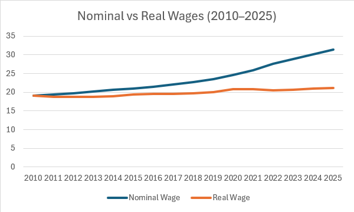

# student-reality-lab-ojeda
# Interactive data story exploring whether entry-level wages have kept up with inflation since 2010. Built with React and Recharts, deployed on Vercel.
___________________________________
## Are Entry-Level Wages Keeping Up With Inflation?
### A Data Story for Students Entering the Workforce
___________________________________
### Essential Question
Have production and nonsupervisory wages in the U.S. kept pace with inflation since 2010?
### Claim
Production and nonsupervisory wages have not kept up with inflation since 2010, resulting in lower real purchasing power for new workers.
### Audience
- College students preparing to enter the workforce
- Recent graduates
- Students comparing wages across years

### STAR Draft
**S - Situation**
* Inflation has risen significantly in recent years. Students entering the workforce question whether wages are actually increasing in meaningful terms or just nominally.

**T - Task**
* Build an interactive data story that allows viewers to compare nominal wages vs inflation-adjusted wages over time and determine whether real purchasing power has increased or decreased.

**A - Action**
- Collect wage data (average hourly earnings or production and nonsupervisory wage proxy)
- Collect CPI (Consumer Price Index) data
- Adjust wages into constant dollars
- Build an interactive toggle: Nominal vs Real wages
- Annotate a key divergence point (e.g., post-2020 inflation spike)

**R - Result (Expected)**
* I expect to show that nominal wages increased, but real wages stagnated or declined during high inflation years (2021-2023). I will report percent change in real wages since 2010.

### Dataset & Provenance
***Wage Data Source***
From: U.S. Bureau of Labor Statistics (BLS)
Link: https://data.bls.gov/timeseries/CES0500000008 (Formatting Adjusted)
Series ID: CES0500000008
Series Title: Average Hourly Earnings of Production and Nonsupervisory Employees
License: Public domain (U.S. government)
Retrieval data: Feb. 26, 2026

***Inflation Data Source***
From: BLS Consumer Price Index (CPI-U)
Link: https://data.bls.gov/timeseries/CUSR0000SA0 (Formatting Adjusted)
Series ID: CUSR0000SA0
Series Title: Consumer Price Index for All Urban Consumers (CPI-U)
License: Public domain (U.S. government)
Retrieval date: Feb. 26, 2026

-----

### Data Dictionary
|Term|Meaning|Units|
|------|---------|-------|
|year|Calendar year|YYYY|
|nominal_wage|average hourly earnings|USD|
|cpi|Consumer Price Index (CPI-U)|Index (1982-84 = 100)|
|real_wage|Inflation-adjusted wage|USD (base year dollars)|
|pct_change_real|Percent change in real wage from base year|%|

----
### Definitions
| Term | How This Project Defines It |
|------|----------------------------|
| Nominal Wage | Average hourly earnings in current dollars, unadjusted for inflation (BLS CES0500000008) |
| Real Wage | Nominal wage converted to 2010 dollars using CPI-U ratio |
| Base Year | 2010 — all real wage comparisons are relative to this year |
| Inflation | Measured by CPI-U (All Urban Consumers, All Items, BLS CUSR0000SA0) |
| Purchasing Power | What one hour of work can actually buy, expressed in constant 2010 dollars |
| Entry-Level Proxy | Production and nonsupervisory workers used as a stand-in for non-management early-career workers |

----

## Data Viability Audit

### Missing Values & Structural Issues
- Both datasets (CES0500000008 and CUSR0000SA0) provide complete monthly
  observations from 2010–2025 with no structural gaps in the selected range.
- 2025 data may include preliminary (P) values in the most recent months.
- **One known gap:** CPI October 2025 is missing from the source file.
  The processing script handles this gracefully by averaging only the
  available months for that year rather than erroring or dropping the row.
- Both datasets are monthly and are aggregated to annual averages in
  `src/lib/processData.js` before use in the UI.

### Weird Fields / Interpretation Concerns
- CPI is reported as an index (1982–84 = 100), not in dollar values —
  it must be used as a ratio to convert nominal wages into real wages.
- The `Annual` column present in the raw CPI file is blank and is ignored
  by the processing script; annual averages are computed from monthly values.
- Wage data is in nominal USD and requires inflation adjustment before
  any meaningful year-over-year purchasing power comparison can be made.
- CPI-U measures price changes for urban consumers broadly and may not
  perfectly represent the specific consumption patterns of students or
  recent graduates (e.g., tuition, rent in college towns).
- The wage series (CES0500000008) covers production and nonsupervisory
  employees as a proxy for entry-level / non-management workers — it does
  not isolate strictly "entry-level" or student-age employees.

### Cleaning & Transformation Plan
All cleaning and transformation is handled automatically by `src/lib/processData.js`.
Steps performed:

1. Parse both raw CSVs and strip any blank or non-numeric fields
2. Average the 12 monthly values per year into a single annual figure
   (months with missing values are excluded from the average, not zeroed)
3. Align both datasets by calendar year (2010–2025)
4. Select 2010 as the base year for inflation adjustment
5. Compute real wages using:
   `Real Wage = Nominal Wage × (CPI_2010 / CPI_current)`
6. Compute percent change in real wages since 2010:
   `pct_change_real = ((real_wage - base_wage) / base_wage) × 100`
7. Round all values to two decimal places for readability
8. Output to `data/processed/processed.json` and `src/data/processed.json`

### What This Dataset Cannot Prove (Limits & Bias)
- **Cannot isolate entry-level workers specifically** — the wage series covers
  all production and nonsupervisory employees, including experienced workers.
- **No regional breakdown** — national averages mask significant variation
  between high cost-of-living metros and lower cost regions.
- **Non-wage compensation excluded** — benefits, bonuses, equity, and
  employer-paid healthcare are not reflected in hourly wage figures.
- **Student-specific costs not captured** — CPI-U does not weight tuition,
  student housing, or other student-specific expenses separately.
- **Cannot determine causation** — the data shows correlation between
  inflation and wage stagnation but cannot explain why wages did not keep pace.
- **Cannot speak to all workers** — gig workers, self-employed individuals,
  and tipped workers are not represented in this series.

### Data Chart Screenshot



- The two-line chart directly answers the essential question by showing both 
  what workers are *paid* (nominal) and what they can actually *buy* (real), 
  making the divergence visible at a glance.
- The flattening of the real wage line after 2020 confirms the claim that 
  inflation has outpaced wage growth, eroding purchasing power for new workers.

----

## Cleaning & Transform Notes
- Raw CSVs contain monthly values; all data is aggregated to annual averages
- Missing CPI value (Oct 2025) is excluded from that year's average gracefully
- Base year 2010 selected as it represents a pre-COVID, stable economic baseline
- All output values rounded to 2 decimal places for UI readability
- Processed output lives in both `/data/processed.json` (pipeline output)
  and `/src/data/processed.json` (React import)

---

## Interaction Design

**View 1 — Nominal vs Real Wages Over Time**
- **Toggle (Nominal / Real / Both):** Lets the viewer isolate each wage
  series independently. Switching to "Real Only" removes the illusion of
  wage growth and directly answers the essential question.
- **Year Slider:** Allows zooming into any time window (e.g., 2018–2022)
  to isolate the inflation period without the noise of earlier years.

**View 2 — Purchasing Power % Change**
- **Chart Type Toggle (Bar / Line):** Bar chart emphasizes individual years
  clearly showing which years were above or below the 2010 baseline. Line
  chart reveals the full trend arc — the rise, spike, crash, and recovery.

Both interactions change the data view, not just styling — satisfying the
assignment requirement for meaningful interaction.

---

## Limits & What I'd Do Next
- Add regional breakdowns by state to show cost-of-living variation
- Isolate wage data specifically for workers aged 18–24
- Include non-wage compensation (benefits, bonuses) for a fuller picture
- Add a third view comparing student-specific costs (tuition, rent) against
  wage growth for a more targeted student audience

---

## How to Run Locally
```bash
git clone https://github.com/edgaroj52218/student-reality-lab-ojeda
cd student-reality-lab-ojeda
npm install
npm start
```

---

## Deployment
Live URL: https://student-reality-lab-ojeda.vercel.app/

Built with React + Recharts. Deployed via Vercel.
